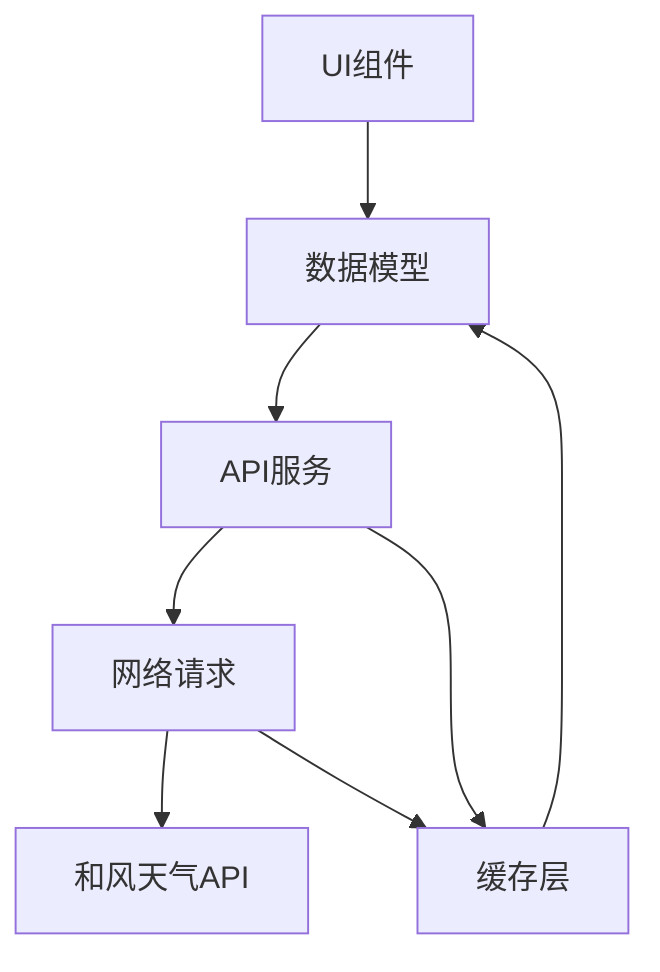

# 和风天气公共API数据处理方案

## 1. 方案概述

本方案设计了一套完整的数据获取、处理和展示系统，完全依赖和风天气提供的公共API，不依赖自定义后端数据库。系统采用分层架构，包括API服务层、数据模型层、缓存层和UI展示层，确保数据的高效获取、正确解析和合理展示。

## 2. 和风天气API基本情况

### 2.1 API类型与覆盖范围

和风天气提供了多种API，涵盖了天气数据的各个方面：

| API类型 | 主要功能 |
|---------|----------|
| 实时天气API | 获取当前天气状况 |
| 7天天气预报API | 获取未来7天的天气预报 |
| 24小时天气预报API | 获取未来24小时的逐小时天气预报 |
| 空气质量API | 获取空气质量指数(AQI)和相关数据 |
| 天气预警API | 获取实时天气预警信息 |
| 生活指数API | 获取各种生活指数数据 |
| 历史天气API | 获取过去的天气数据 |

### 2.2 API调用限制

- 免费开发者账号有调用次数限制
- API响应数据有缓存时间（通常为10-30分钟）
- 需要API密钥(KEY)进行身份验证
- 部分高级功能需要付费订阅

## 3. 系统架构设计

### 3.1 分层架构

```
┌─────────────────────────────────────────────────────────┐
│                     UI展示层                            │
│  ┌───────────┐  ┌───────────┐  ┌─────────────────────┐  │
│  │ WeatherUI │  │ CityUI    │  │ SettingsUI          │  │
│  └───────────┘  └───────────┘  └─────────────────────┘  │
└─────────────────────────────────────────────────────────┘
            │                    │                    │
            ▼                    ▼                    ▼
┌─────────────────────────────────────────────────────────┐
│                     数据模型层                            │
│  ┌───────────┐  ┌───────────┐  ┌─────────────────────┐  │
│  │ Weather   │  │ City      │  │ AirQuality          │  │
│  └───────────┘  └───────────┘  └─────────────────────┘  │
└─────────────────────────────────────────────────────────┘
            │                    │                    │
            ▼                    ▼                    ▼
┌─────────────────────────────────────────────────────────┐
│                     API服务层                            │
│  ┌───────────┐  ┌───────────┐  ┌─────────────────────┐  │
│  │ WeatherAPI│  │ CityAPI   │  │ AirQualityAPI       │  │
│  └───────────┘  └───────────┘  └─────────────────────┘  │
└─────────────────────────────────────────────────────────┘
            │                    │                    │
            ▼                    ▼                    ▼
┌─────────────────────────────────────────────────────────┐
│                     网络层                               │
│  ┌───────────┐  ┌───────────┐  ┌─────────────────────┐  │
│  │ HttpClient│  │ Request   │  │ Response            │  │
│  └───────────┘  └───────────┘  └─────────────────────┘  │
└─────────────────────────────────────────────────────────┘
            │                    │                    │
            ▼                    ▼                    ▼
┌─────────────────────────────────────────────────────────┐
│                     缓存层                               │
│  ┌───────────┐  ┌───────────┐  ┌─────────────────────┐  │
│  │ SharedPreferences │  │ FileCache │  │ MemoryCache        │  │
│  └───────────┘  └───────────┘  └─────────────────────┘  │
└─────────────────────────────────────────────────────────┘
```

### 3.2 核心组件关系



## 4. API调用方法设计

### 4.1 基础配置

```dart
// lib/services/weather/weather_service.dart

class WeatherApiConfig {
  // 和风天气API密钥
  static const String apiKey = 'your_api_key_here';
  // API基础URL
  static const String baseUrl = 'https://devapi.qweather.com/v7';
  // 地理编码API基础URL
  static const String geoBaseUrl = 'https://geoapi.qweather.com/v2';
  // API响应缓存时间（分钟）
  static const int cacheDurationMinutes = 30;
}
```

### 4.2 API调用服务

```dart
// lib/services/weather/weather_service.dart

class QWeatherService {
  final Dio _dio = Dio();
  final WeatherCache _cache = WeatherCache();

  QWeatherService() {
    // 初始化Dio
    _dio.options = BaseOptions(
      baseUrl: WeatherApiConfig.baseUrl,
      connectTimeout: Duration(seconds: 10),
      receiveTimeout: Duration(seconds: 10),
    );
    
    // 添加请求拦截器，自动添加API密钥
    _dio.interceptors.add(InterceptorsWrapper(
      onRequest: (options, handler) {
        options.queryParameters['key'] = WeatherApiConfig.apiKey;
        return handler.next(options);
      },
    ));
  }

  // 获取实时天气数据
  Future<WeatherNowResponse> getWeatherNow({required String id}) async {
    // 先检查缓存
    final cachedData = await _cache.getWeatherNow(id);
    if (cachedData != null) {
      return cachedData;
    }

    // 缓存不存在或已过期，调用API
    final response = await _dio.get('/weather/now', queryParameters: {
      'location': id,
    });

    // 解析响应
    final weatherNowResponse = WeatherNowResponse.fromJson(response.data);
    
    // 保存到缓存
    await _cache.saveWeatherNow(id, weatherNowResponse);
    
    return weatherNowResponse;
  }

  // 其他API方法...
}
```

## 5. 数据解析逻辑

### 5.1 数据模型设计

采用工厂构造函数+JSON序列化的方式实现数据解析：

```dart
// lib/models/weather/weather_models.dart

class WeatherNowResponse {
  final String code;
  final Now now;
  final String updateTime;

  WeatherNowResponse({
    required this.code,
    required this.now,
    required this.updateTime,
  });

  factory WeatherNowResponse.fromJson(Map<String, dynamic> json) {
    return WeatherNowResponse(
      code: json['code'],
      now: Now.fromJson(json['now']),
      updateTime: json['updateTime'],
    );
  }
}

class Now {
  final String temp;
  final String feelsLike;
  final String icon;
  final String text;
  final String wind360;
  final String windDir;
  final String windScale;
  final String windSpeed;
  final String humidity;
  final String precip;
  final String pressure;
  final String vis;
  final String cloud;
  final String dew;

  Now({
    required this.temp,
    required this.feelsLike,
    required this.icon,
    required this.text,
    required this.wind360,
    required this.windDir,
    required this.windScale,
    required this.windSpeed,
    required this.humidity,
    required this.precip,
    required this.pressure,
    required this.vis,
    required this.cloud,
    required this.dew,
  });

  factory Now.fromJson(Map<String, dynamic> json) {
    return Now(
      temp: json['temp'],
      feelsLike: json['feelsLike'],
      icon: json['icon'],
      text: json['text'],
      wind360: json['wind360'],
      windDir: json['windDir'],
      windScale: json['windScale'],
      windSpeed: json['windSpeed'],
      humidity: json['humidity'],
      precip: json['precip'],
      pressure: json['pressure'],
      vis: json['vis'],
      cloud: json['cloud'],
      dew: json['dew'],
    );
  }
}
```

### 5.2 数据解析流程

1. API响应返回JSON字符串
2. 使用Dio自动将JSON转换为Map<String, dynamic>
3. 通过工厂构造函数将Map转换为强类型数据模型
4. 对模型数据进行验证和格式化
5. 返回给上层调用者使用

## 6. 错误处理机制

### 6.1 错误类型定义

```dart
// lib/utils/weather_error.dart

enum WeatherErrorType {
  networkError,      // 网络错误
  serverError,       // 服务器错误
  dataError,         // 数据格式错误
  apiLimitExceeded,  // API调用次数超限
  locationError,     // 位置信息错误
  unknownError,      // 未知错误
}

class WeatherError implements Exception {
  final WeatherErrorType type;
  final String message;
  final dynamic data;

  WeatherError({
    required this.type,
    required this.message,
    this.data,
  });

  @override
  String toString() {
    return 'WeatherError: $type - $message';
  }
}
```

### 6.2 错误处理流程

```dart
// lib/services/weather/weather_service.dart

Future<WeatherNowResponse> getWeatherNow({required String id}) async {
  try {
    // 尝试获取缓存
    final cachedData = await _cache.getWeatherNow(id);
    if (cachedData != null) {
      return cachedData;
    }

    // 调用API
    final response = await _dio.get('/weather/now', queryParameters: {
      'location': id,
    });

    // 检查API返回码
    final code = response.data['code'];
    if (code != '200') {
      throw WeatherError(
        type: _mapErrorCode(code),
        message: _getErrorMessage(code),
        data: response.data,
      );
    }

    // 解析数据
    final weatherNowResponse = WeatherNowResponse.fromJson(response.data);
    
    // 保存到缓存
    await _cache.saveWeatherNow(id, weatherNowResponse);
    
    return weatherNowResponse;
  } on DioException catch (e) {
    // 处理网络错误
    throw WeatherError(
      type: WeatherErrorType.networkError,
      message: '网络连接失败，请检查网络设置',
      data: e,
    );
  } on FormatException catch (e) {
    // 处理数据格式错误
    throw WeatherError(
      type: WeatherErrorType.dataError,
      message: '数据格式错误',
      data: e,
    );
  } catch (e) {
    // 处理其他未知错误
    throw WeatherError(
      type: WeatherErrorType.unknownError,
      message: '获取天气数据失败',
      data: e,
    );
  }
}

// 根据API返回码映射错误类型
WeatherErrorType _mapErrorCode(String code) {
  switch (code) {
    case '401':
      return WeatherErrorType.apiLimitExceeded;
    case '404':
      return WeatherErrorType.locationError;
    case '500':
      return WeatherErrorType.serverError;
    default:
      return WeatherErrorType.unknownError;
  }
}
```

### 6.3 UI层错误处理

```dart
// 在UI组件中使用
Future<void> _fetchWeatherData() async {
  setState(() {
    _isLoading = true;
    _error = null;
  });
  
  try {
    final weatherData = await _weatherService.getWeatherNow(id: widget.id);
    setState(() {
      _nowResponse = weatherData;
      _isLoading = false;
    });
  } catch (e) {
    setState(() {
      _isLoading = false;
      _error = e;
    });
    
    // 显示错误提示
    ScaffoldMessenger.of(context).showSnackBar(
      SnackBar(
        content: Text(e is WeatherError ? e.message : '获取天气数据失败'),
        backgroundColor: Colors.red,
      ),
    );
  }
}
```

## 7. 数据缓存策略

### 7.1 缓存设计原则

1. **多级缓存**：采用内存缓存+本地存储缓存的多级缓存机制
2. **过期时间**：根据API响应的缓存建议设置合理的过期时间
3. **缓存清理**：定期清理过期缓存，避免占用过多存储空间
4. **缓存优先级**：优先使用内存缓存，其次是本地存储缓存

### 7.2 缓存实现

```dart
// lib/services/weather/weather_cache.dart

class WeatherCache {
  final SharedPreferences _prefs;
  final Map<String, WeatherNowResponse> _memoryCache = {};
  
  WeatherCache() : _prefs = await SharedPreferences.getInstance();
  
  // 获取实时天气缓存
  Future<WeatherNowResponse?> getWeatherNow(String locationId) async {
    // 先检查内存缓存
    if (_memoryCache.containsKey(locationId)) {
      final cachedData = _memoryCache[locationId]!;
      if (!_isCacheExpired(cachedData.updateTime)) {
        return cachedData;
      }
    }
    
    // 内存缓存不存在或已过期，检查本地存储
    final cacheKey = 'weather_now_$locationId';
    final cacheJson = _prefs.getString(cacheKey);
    if (cacheJson != null) {
      try {
        final cacheData = jsonDecode(cacheJson);
        final weatherData = WeatherNowResponse.fromJson(cacheData);
        
        if (!_isCacheExpired(weatherData.updateTime)) {
          // 更新内存缓存
          _memoryCache[locationId] = weatherData;
          return weatherData;
        }
      } catch (e) {
        // 解析失败，删除无效缓存
        await _prefs.remove(cacheKey);
      }
    }
    
    return null;
  }
  
  // 保存实时天气缓存
  Future<void> saveWeatherNow(String locationId, WeatherNowResponse data) async {
    // 更新内存缓存
    _memoryCache[locationId] = data;
    
    // 更新本地存储
    final cacheKey = 'weather_now_$locationId';
    await _prefs.setString(cacheKey, jsonEncode(data.toJson()));
  }
  
  // 检查缓存是否过期
  bool _isCacheExpired(String updateTime) {
    final updateDateTime = DateTime.parse(updateTime);
    final now = DateTime.now();
    final duration = now.difference(updateDateTime);
    return duration.inMinutes > WeatherApiConfig.cacheDurationMinutes;
  }
  
  // 清理所有过期缓存
  Future<void> cleanupExpiredCache() async {
    // 清理内存缓存
    _memoryCache.removeWhere((key, value) => _isCacheExpired(value.updateTime));
    
    // 清理本地存储缓存
    final allKeys = _prefs.getKeys();
    for (final key in allKeys) {
      if (key.startsWith('weather_')) {
        final cacheJson = _prefs.getString(key);
        if (cacheJson != null) {
          try {
            final cacheData = jsonDecode(cacheJson);
            if (_isCacheExpired(cacheData['updateTime'])) {
              await _prefs.remove(key);
            }
          } catch (e) {
            // 解析失败，删除无效缓存
            await _prefs.remove(key);
          }
        }
      }
    }
  }
}
```

### 7.3 缓存使用策略

1. **应用启动时**：初始化缓存服务，加载必要的缓存数据
2. **API调用前**：检查缓存是否存在且有效，有效则直接返回缓存数据
3. **API调用成功后**：更新缓存数据
4. **定期清理**：每24小时清理一次过期缓存
5. **用户手动刷新时**：忽略缓存，直接调用API获取最新数据

## 8. 前端数据展示方案

### 8.1 数据展示原则

1. **分层展示**：将天气数据分为核心数据、详细数据和辅助数据三个层级
2. **可视化优先**：使用图标、图表等可视化元素展示数据
3. **响应式设计**：适配不同屏幕尺寸和设备
4. **交互友好**：提供下拉刷新、点击查看详情等交互方式
5. **性能优化**：使用懒加载、缓存等方式优化展示性能

### 8.2 核心数据展示

核心数据包括：
- 当前温度
- 天气状况（文字+图标）
- 体感温度
- 城市名称

展示方式：
```dart
// lib/widgets/weather_now_widget.dart

class WeatherNowWidget extends StatelessWidget {
  final Now now;
  final String cityName;
  
  const WeatherNowWidget({required this.now, required this.cityName});
  
  @override
  Widget build(BuildContext context) {
    return Column(
      mainAxisAlignment: MainAxisAlignment.center,
      children: [
        Text(cityName, style: TextStyle(fontSize: 24, fontWeight: FontWeight.bold)),
        SizedBox(height: 20),
        Row(
          mainAxisAlignment: MainAxisAlignment.center,
          children: [
            QIcon(iconCode: now.icon, size: 60),
            SizedBox(width: 20),
            Text(
              '${now.temp}°',
              style: TextStyle(fontSize: 72, fontWeight: FontWeight.bold),
            ),
          ],
        ),
        SizedBox(height: 10),
        Text(
          now.text,
          style: TextStyle(fontSize: 24),
        ),
        SizedBox(height: 10),
        Text(
          '体感温度: ${now.feelsLike}°',
          style: TextStyle(fontSize: 16, color: Colors.grey),
        ),
      ],
    );
  }
}
```

### 8.3 详细数据展示

详细数据包括：
- 湿度
- 风向风速
- 气压
- 能见度
- 紫外线指数
- 空气质量

展示方式：使用卡片式布局，分区域展示不同类型的数据

### 8.4 预报数据展示

预报数据包括：
- 24小时天气预报
- 7天天气预报

展示方式：
- 24小时预报：水平滚动列表
- 7天预报：垂直列表

## 9. 性能优化建议

### 9.1 网络请求优化

1. **合并请求**：将多个相关的API请求合并为一个批量请求
2. **请求防抖**：在搜索城市时使用防抖，避免频繁调用API
3. **请求重试**：对失败的请求进行有限次数的重试
4. **请求优先级**：根据数据重要性设置不同的请求优先级

### 9.2 数据处理优化

1. **懒加载**：对非核心数据采用懒加载方式
2. **数据预加载**：在用户可能访问的数据之前进行预加载
3. **数据缓存**：合理使用缓存，减少API调用次数
4. **数据压缩**：对本地存储的数据进行压缩，减少存储空间占用

### 9.3 UI渲染优化

1. **使用const构造函数**：对不变的Widget使用const构造函数
2. **使用RepaintBoundary**：对频繁重绘的Widget使用RepaintBoundary隔离
3. **使用ListView.builder**：对长列表使用ListView.builder进行懒加载
4. **减少Widget层级**：优化Widget树结构，减少不必要的层级

## 10. 开发与测试建议

### 10.1 开发建议

1. **模块化开发**：将不同功能模块分离，便于维护和扩展
2. **代码规范**：遵循Flutter代码规范，使用lint工具检查代码质量
3. **文档化**：为关键代码添加注释，生成API文档
4. **版本控制**：使用Git进行版本控制，合理划分分支

### 10.2 测试建议

1. **单元测试**：对核心功能和工具类进行单元测试
2. **集成测试**：测试不同模块之间的集成情况
3. **UI测试**：对关键UI组件进行自动化测试
4. **性能测试**：测试应用在不同网络环境下的性能表现
5. **兼容性测试**：测试应用在不同设备和系统版本上的兼容性

## 11. 监控与日志

### 11.1 日志记录

```dart
// lib/utils/logger.dart

class Logger {
  static void d(String message, [dynamic data]) {
    if (kDebugMode) {
      print('DEBUG: $message${data != null ? ' - $data' : ''}');
    }
  }

  static void e(String message, [dynamic error, StackTrace? stackTrace]) {
    print('ERROR: $message${error != null ? ' - $error' : ''}');
    if (stackTrace != null) {
      print(stackTrace);
    }
    // 可以添加远程日志上报逻辑
  }

  // 其他日志级别...
}
```

### 11.2 性能监控

1. **使用Flutter DevTools**：监控应用性能、内存使用和网络请求
2. **添加性能指标**：记录关键操作的执行时间
3. **异常监控**：捕获并上报应用异常

## 12. 总结

本方案设计了一套完整的基于和风天气公共API的数据获取、处理和展示系统，包括：

1. **API调用方法**：使用Dio库进行API调用，添加请求拦截器自动处理API密钥
2. **数据解析逻辑**：采用工厂构造函数+JSON序列化的方式实现强类型数据解析
3. **错误处理机制**：定义了完整的错误类型和处理流程，提供友好的错误提示
4. **数据缓存策略**：实现了多级缓存机制，包括内存缓存和本地存储缓存
5. **前端展示方案**：设计了分层的数据展示方式，包括核心数据、详细数据和预报数据
6. **性能优化建议**：提供了网络请求、数据处理和UI渲染等方面的优化建议
7. **开发与测试建议**：包括模块化开发、代码规范、测试策略等
8. **监控与日志**：实现了日志记录和性能监控机制

该方案完全依赖和风天气公共API，不依赖自定义后端数据库，适合资源有限的小型应用或初创项目。方案采用了分层架构和模块化设计，便于维护和扩展，同时考虑了性能优化和用户体验，能够提供稳定、高效的天气数据服务。